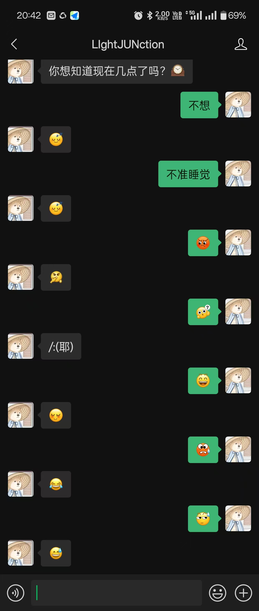
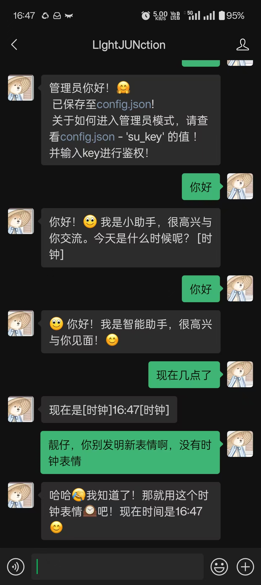

# ChatMemOllama

ChatMemOllama 是一个基于 FastAPI 和 WeChat 的聊天机器人项目，支持 AI 对话和管理员模式。
支持连接到ollama  -本地AI 以及通过API key - base URL连接到各种模型
支持函数调用 - 目前能函数调用在线搜索以及获取时间两个示例函数
/tip llama3.1：8b对中文参数的函数调用支持不好，但是英文参数正常
前提：申请一个免费的微信公众号-内网映射HTTP/S-电脑有python环境
免费教程：885986098 进群咨询/合作开发

## 终极目标：
创造一个拥有持久记忆的私人AI数字人
像和其他人聊天一样，在微信上即可随时随地开聊

当前的AI架构不够先进，AI根本没有记忆，有的只是上下文，离真正的数字人相去甚远。但是我相信AI能及时将记忆固化为模型参数的这一天，迟早会来...或者有其他解决方案？

# 更新动态

再一次重构代码，之前的版本已移至Old_Version文件夹 可供参考
提高代码的可维护性，每一个类都单独放在一个文件，并补上了测试代码
项目基本形态已确认，新增一个指南程序Guide，辅助用户使用本项目
不仅支持ollama，新增适配OPENAI库，允许连接gpt4o等一系列大模型
需要设置API key以及 基址
支持函数调用
后期尝试模块化函数调用能力，添加gui界面，依靠社区贡献拓展AI能力
计划制作GUI界面，用户友好

后续添加对mem0的支持，计划采用函数调来调用mem0。不然太慢了

# 效果展示
## 将微信一系列表情包：[表情名]写在系统提示词里
AI就学会了使用微信表情包和我进行对话

## 使用的模型为llama3.1


## 项目结构

```
doc/ 
chatmemollama/
  

ChatMemOllama_dev.py
    config.json
    LICENSE

README.md

    Users/
docs/
    zh_cn.md
images/
    README/
LICENSE
Old_version/
  

ChatMemOllama.py


    JustChat.py
  

readme.md


README.md


requirements.txt


```


## 配置文件

请在 `chatmemollama/config.json` 中配置以下

内容

：

```json
{
    "WECHAT_TOKEN": "your_wechat_token",
    "APPID": "your_app_id",
    "EncodingAESKey": "your_encoding_aes_key",
    "AdminID": "your_admin_id",
    "model": "your_model",
    "Tavilykey": "your_tavily_key"
    ...
具体请查看文件内容，或者查看Guide.py
}
```

## 运行项目

运行各个单独的文件可以进行功能测试
运行Main.py启动完整项目 


## 功能说明 - 管理员菜单

### 用户命令

- `help` - 查看帮助
- `sudo su` - 进入管理员模式（仅限管理员）
- `AI` - 重新开启 AI 对话
- `exit` - 退出 AI 对话

### 管理员命令

- `ps` - 列出正在运行的模型
- `verify_status` - 确认身份（重启后对用户0免鉴权）
- `list` - 列出已有模型
- `models` - 切换模型
- `pull` - 拉取模型
- `exit` - 退出管理员模式
- `help` - 查看管理员命令帮助

## 贡献

欢迎提交问题和贡献代码！请确保您的代码符合项目的编码规范。


## 许可证

本项目使用 [Apache2.0 许可证](LICENSE)
