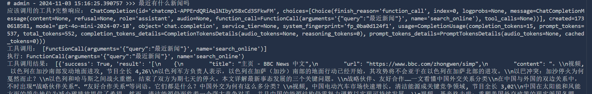
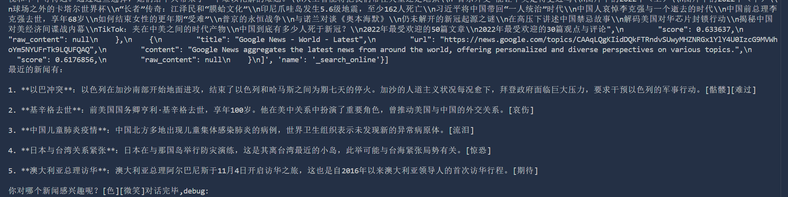
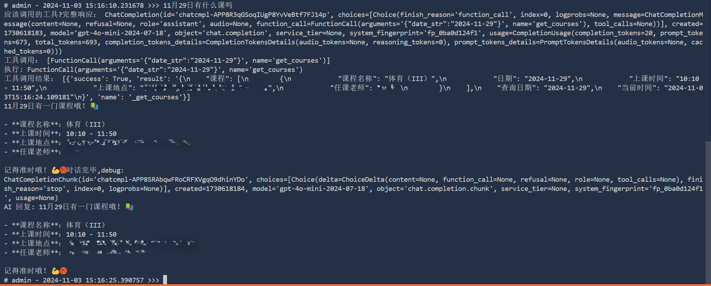
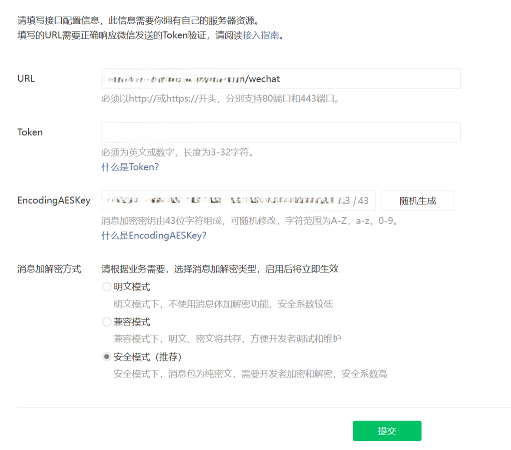

# ChatMemOllama

ChatMemOllama 是一个基于 FastAPI 和 WeChat 的聊天机器人项目，支持 AI 对话和管理员模式。

## 终极目标：

创造一个拥有持久记忆的私人AI数字人
像和其他人聊天一样，在微信上即可随时随地开聊


加入开发者群聊，共同进步
885986098


# 效果展示

### 在线搜索





### 查询课表



（这个函数调用属于个人用途，每个学校的格式可能有所不同，这里是通过抓包获取的课表信息  如果不会抓包可以试试直接套用我这个格式。）

## 将微信一系列表情包：[表情名]写在系统提示词里使用效果--模型llama3.1:8b

AI就学会了使用微信表情包和我进行对话


## 使用的模型为llama3.1


## 项目结构

```
doc/ 
chatmemollama/
  

ChatMemOllama_dev.py
    config.json
    LICENSE

README.md

    Users/
docs/
    zh_cn.md
images/
    README/
LICENSE
Old_version/
  

ChatMemOllama.py


    JustChat.py
  

readme.md


README.md


requirements.txt


```

## 安装依赖

请确保您的 `requirements.txt` 文件包含以下依赖项：

```plaintext
fastapi
wechatpy
uvicorn
requests
beautifulsoup4
mem0
tavily
```

您可以使用以下命令安装依赖：

```sh
pip install -r 

requirements.txt


```

## 配置文件

`关于配置的解释` 

```json
{
    "WECHAT_TOKEN": "your_wechat_token",
    "APPID": "your_app_id",
    "EncodingAESKey": "your_encoding_aes_key",
    "AdminID": "your_admin_id",
    "mem0config": "your_mem0_config",
    "model": "your_model",
    "verify_status": "False",
    "Tavilykey": "your_tavily_key"
}
```



这是微信公众号的配置  -- 在URL/wechat 接收信息后转发给本地端口8000（默认）

## 运行项目

您可以使用以下命令启动项目：

```py
chatmemollama_dev.py
```

## 功能说明

### 用户命令

- `help` - 查看帮助
- `sudo su` - 进入管理员模式（仅限管理员）
- `AI` - 重新开启 AI 对话
- `exit` - 退出 AI 对话

### 管理员命令

- `ps` - 列出正在运行的模型
- `verify_status` - 确认身份（重启后对用户0免鉴权）
- `list` - 列出已有模型
- `models` - 切换模型
- `pull` - 拉取模型
- `exit` - 退出管理员模式
- `help` - 查看管理员命令帮助

## 贡献

欢迎提交问题和贡献代码！请确保您的代码符合项目的编码规范。

# 更新计划

重新打造项目核心代码
将允许使用非本地AI

将各部分

- 微信交互类
- AI调用类
- 用户管理类
  这主要的类分开写到不同文件

加强逻辑处理部分

将项目模块化以更好的支持新功能

动态拓展函数调用

优化微信服务器5秒超时逻辑处理

-项目文件夹ChatMemOllama

- AIsystem.py
- WechatConfig.py
- UserInfo.py
- Main.py
- Guide.py

## 后续考虑制作GUI管理界面

## 早期开发阶段 任何部分都可能会变！

## 许可证

本项目使用 [Apache2.0 许可证](LICENSE)
